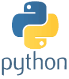
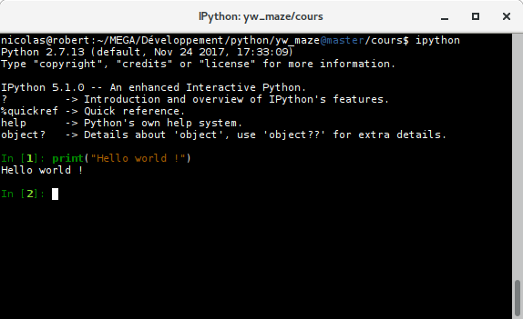
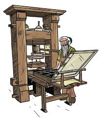
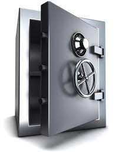

# Apprendre la programmation pour les enfants

## Leçon 1

Python est un **langage de programmation**, c'est un outil pour dire à un
ordinateur, ce que l'on veut qu'il fasse.
Par exemple, affiche ceci, effectue ce calcul, s'il ce produit un événement,
alors effectue une action...

### Afficher sur la console et les types

Ouvre une console et lance **ipython**:

    ipython

Tape `print("Hello world !")`:

    In [1]: print("Hello world !")
    Hello world !

Ce qui est entre guillemets, " est appelé **string** ou
**chaîne de caractères**.

Tape `print(2)`:

    In [2]: print(2)
    2

2 est nombre.

**chaînes de caractères** et **nombres** font partie des **types primitifs** de
python.
Il en existe d'autres, que nous verrons petit à petit.

### Variables, assignations, expressions

Une **variable** sert à stocker une donnée, par exemple, d'un type primitif, à
s'en souvenir, pour cela, on **assigne** une valeur à un nom :

    variable = 12

Ensuite, on peut utiliser **variable** à la place de sa valeur, ainsi:

    print(variable)
    12

est la même chose que:

    print(12)
    12

Parce que **variable** stocke la valeur **12**.

Essayer en stockant la chaîne de caractères `"Je m'appelle Anna"` dans
`variable`.

### Les mots que tu as appris

**langage de programmation**  
**chaîne de caractères**  
**types primitifs**  
**variable**  
**assignation**  

