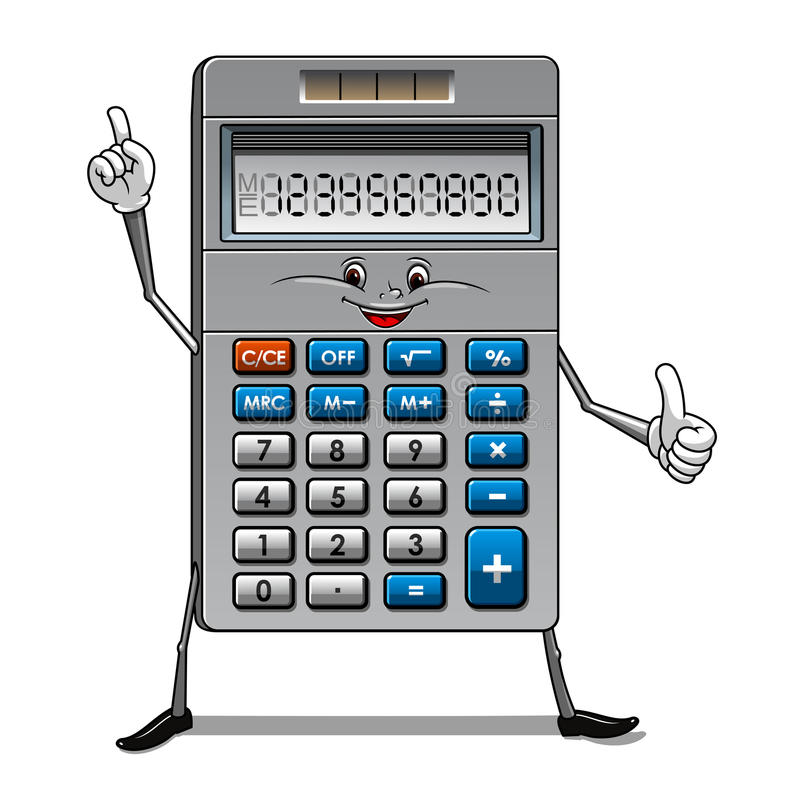

# Séance 2

## Les expressions

Une **expression** peut-être par exemple, un calcul, addition, multiplication...

Exemple:

    In [3]: a = 2 + 13

    In [4]: print(a)
    15

L'**expression** est **évaluée** et son résultat est stocké dans la variable
**a**.

Autres opérations :

 * soustraction : `-`
 * multiplication : `*`
 * division : `/`

Essaye-les !  
Écris, par exemple une multiplication.  
Essaye aussi d'écrire des expressions avec plusieurs opérations.

L'ordinateur sait faire les calculs **super vite** !

Sais-tu calculer `127463200 + 551302122` de tête ? Non ?
Alors demande à l'ordinateur de le faire !

## Les mots que tu as appris

**expression**  
**évaluation**  

