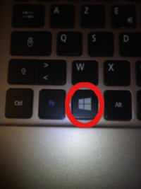
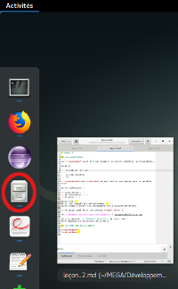
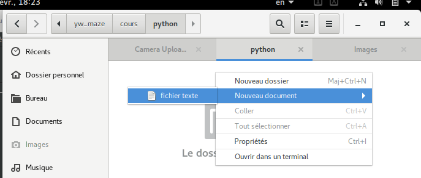
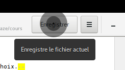
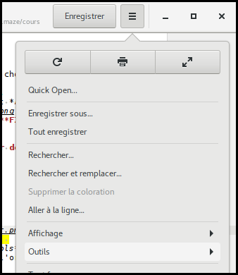
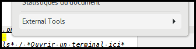
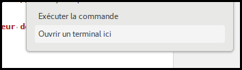

# Séance 3

## Enregistrer un programme dans un fichier

1. Ouvre *nautilus*, va dans un dossier de ton choix.  
   .
   .
2. Fais *clic droit* puis *Nouveau document* et *Fichier texte*.  
   
3. Renomme-le en *hello_world.py* (appuie sur **F2**)
4. Clique avec le bouton gauche dessus

Un nouveau logiciel s'ouvre, c'est un **éditeur de texte**.

5. Tape dedans :

    \#!/usr/bin/env python

    print("hello world !")

6. Enregistre-le  
   
7. Ouvre une **console** (ou un **terminal**):  
   Clique sur *Menu* / *Outils* / *External Tools* / *Ouvrir un terminal ici*  
   
   
   

8. Tape `chmod +x ./hello_world.py` (ça dit à l'ordinateur que c'est un
   programme)
9. Tape `./hello_world.py`

Tu peux ensuite modifier ton programme comme tu veux.

## Les mots que tu as appris

**éditeur de texte**  
**terminal**
